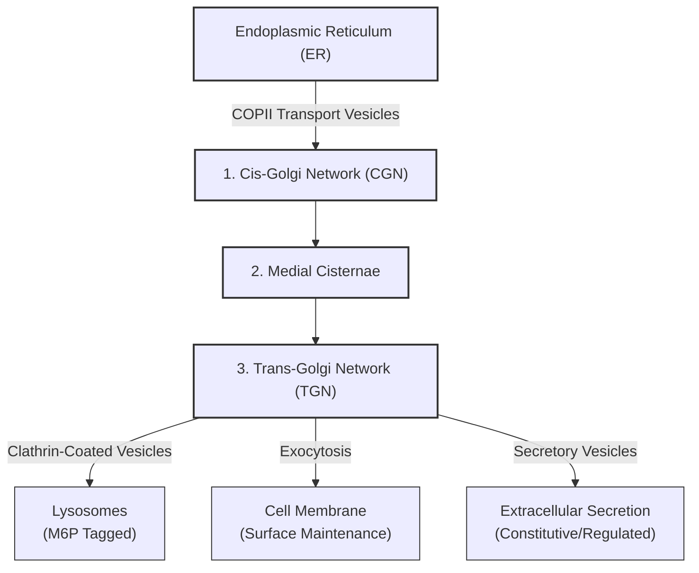
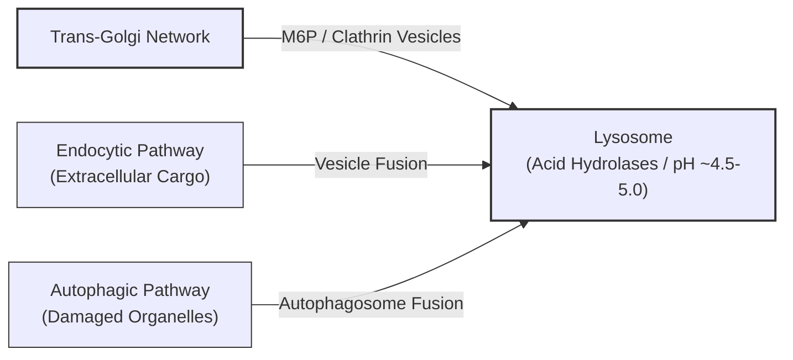
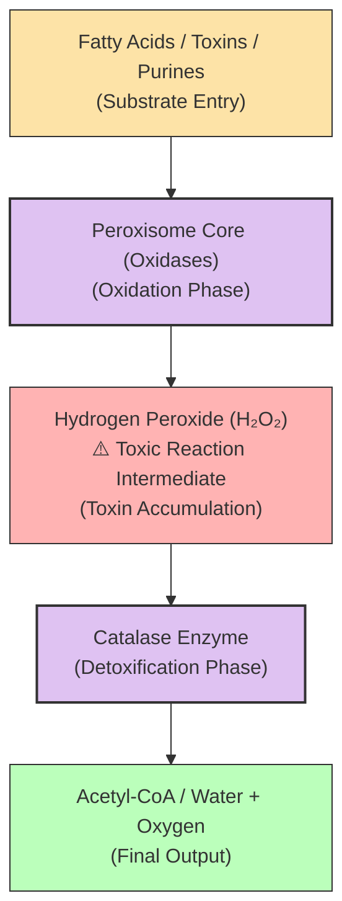
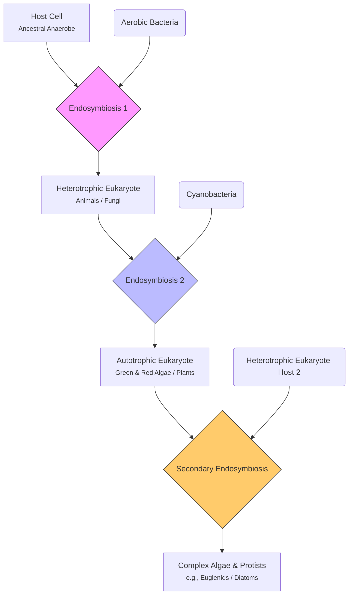

---
tags:
  - sem1
  - major
  - cell-theory
  - prokaryotes
  - prokaryotes-classification
aliases:
  - Cell theory
  - Genetics
  - Sem 1
  - unit 01
cssclasses:
  - unit-01
---
# Cell Theory 
#cell-theory 

- Fundamental scientific theory of biology according to which [cells](https://www.britannica.com/science/cell-biology) are held to be the basic unit of all living [tissues](https://www.britannica.com/science/tissue).
- Proposed by:
	1. **Matthias Schleiden**: German scientist 
		He stated that all plants are composed of different types of cells that form plant tissues.
	2. **Theodore Schwann**: German zoologist 
		He reported that all animals are composed of cells and cellular products.
		Cell is the basic structural unit of all living organisms.
	3. **Rudolf Virchow**(1855):   
		He modified cell theory by adding ==*"Omnis cellula e cellua"*==.
		Which means that all cells exist from pre existing cells.
- So now cell theory can be stated as:
  1. All living organisms are composed of cells and products of cells.
  2. All cells rise from pre-existing cells(==*omnis cellula e cellua*==)
## What is a Cell? 
- A cell is the ==fundamental unit of life== that makes up all living organisms, from unicellular organisms like bacterial to multicellular organisms like humans.
- Each cell can perform essential life processes independently or in coordination with other cells.
- The cell was 1st discovered by **Robert Hooke** in **1665**.
- He examined a thin slice of cork under a custom compound microscope.
- He saw honeycomb like, empty compartments and named them "cells" because they resembled the small rooms(==cellula==) lived in by monks.
>[!abstract] Important
>* **Robert Brown** 1st discovered the nucleus of a cell.
>* **Antonie Van Leeuwenhoek** 1st discovered a living cell like blood cells, spermatozoa, etc.
## Classification of Cells
 

![[cell classification.png|464]]

- - - 
## Prokaryotes

- **Prokaryotes** are unicellular organisms that lack a membrane-bound nucleus and organelles.
- They represent the **simplest from of life** and are fundamental to understanding biology.
- Their genetic material is generally circular and resides in the **nucleoid region**.
### Key Characteristics of Prokaryotes
- No nucleus(DNA free cytoplasm)
- Cell wall and cell membrane is present 
- 70s type of ribosomes
- Reproduction via binary fission 
### Classification of Prokaryotes
 
1. On the basis of shape
	- **Cocci**: Spherical cells(e.g., Streptococcus)
	- **Bacilli**: Rod-shaped cells (e.g., Lactobacillus) 
	- **Spirillia**: Spiral-shaped cells (e.g., Helicobecter) 
	- **Comma-shaped**: Curved rods (e.g., Vibrio) 
2. On the basis of **Gram staining** 
	- **Gram +ve**: 
		Thick peptidoglycan layer, stain purple
	- **Gram -ve**:
		Thin peptidoglycan layer with outer membrane, stain pink

> [!NOTE] **The Core Mechanism of Gram Staining**
> Gram staining differentiates bacteria based strictly on the physical thickness and structure of their **peptidoglycan cell wall**.
> **Steps Used**:
> 1. Crystal violet is added.
> 2. Gram's iodine is added and it forms **Crystal Violet-Idinone** complex inside.
> 3. Alcohol/Acetone is used as decolourizer
> 4. Now a counterstain**Safranine** is added and it gives purple for G+ve and pink or red for G-ve.
>
> * **Gram-Positive (+ve) 🟣 Purple:** 
>   * Has a **thick** peptidoglycan layer.
>   * Dehydrates and shrinks when exposed to alcohol, permanently trapping the large **Crystal Violet-Idinone** complex inside.
> * **Gram-Negative (-ve) 💗 Pink:** 
>   * Has a **thin** peptidoglycan layer + an outer lipid membrane.
>   * Alcohol dissolves the outer membrane and washes away the primary purple dye, allowing the cells to absorb the **Safranin counterstain**.
>
> | Step | Chemical Agent | Gram +ve | Gram -ve |
| :--- | :--- | :--- | :--- |
| **1. Primary Stain** | Crystal Violet | Purple 🟣 | Purple 🟣 |
| **2. Mordant** | Iodine | Purple 🔒 | Purple 🔒 |
| **3. Decolorizer** | Alcohol / Acetone | **Purple 🟣** | **Clear ⚪** |
| **4. Counterstain** | Safranin | **Purple 🟣** | **Pink 💗** |

### Domains of Prokaryotes

![[domain of prokaryote.png|700]]

### Ultrastructure of Prokaryotes

![[prokaryotic cell.png|688]]
- Prokaryotes are single-celled organisms **lacking a membrane-bound nucleus and organelles.** 
- Their cellular architecture is optimized for rapid reproduction and survival in diverse environments.
### Cell Envelope
1. **Glycocalyx**  
	- **Capsule**: Highly organised, thick polysaccharide layer. It prevents phagocytosis and desiccation.
	- **Slime Layer**: Unorganised, loose and easily washed-off layer. It aids in adherence to surfaces.
2. **Cell Wall**  
	- **Function**: Provides structural integrity, maintains shape, and prevents osmotic lysis.
	- **Composition**: Made of peptidoglycan (murein), a network of modified sugars cross-linked by short amino acid chains.
	- **Gram-Positive**: Thick peptidoglycan layer containing teichoic acids. Stains purple.
	- **Gram-Negative**: Thin peptidoglycan layer surrounded by an outer membrane containing lipopolysaccharides (LPS). Stains pink.
3. **Plasma Membrane**  
	- **Structure**: Phospholipid bilayer embedded with integral and peripheral proteins. It lacks cholesterol (contains hopanoids instead).
	- **Function**: Selectively permeable barrier regulating nutrient transport and waste export.
	- **Mesosomes**: Infoldings of the plasma membrane that increase surface area for respiration and DNA replication.
### Cytoplasmic Region
1. **Nucleoid** 
	- **Description**: Irregularly shaped, non-membrane-bound region.
	- **Genomic DNA**: Single, circular, double-stranded chromosome.
	- **Coiling**: DNA is highly folded and supercoiled with the help of RNA and non-histone architectural proteins.
2. **Plasmids** 
	- **Definition**: Small, circular, double-stranded, extrachromosomal DNA molecules.
	- **Traits**: Replicate autonomously. They carry non-essential but advantageous genes, such as antibiotic resistance or toxin production.
3. **Ribosomes** 
	- **Type**: 70S ribosomes, consisting of a small 30S subunit and a large 50S subunit.
	- **Function**: Sites of protein synthesis. Often found in chains linked by mRNA, forming **polysomes**
4. **Inclusion Bodies** 
	- **Purpose**: Storage reserves for nutrients and energy.
	- **Examples**: Volutin granules (phosphate), glycogen granules, lipid droplets (PHB), and gas vacuoles for buoyancy
### External Structures
1. **Flagella** 
	- **Structure**: Long, helical appendages made of the protein **flagellin**. It consists of three parts: filament, hook, and basal body.
	- **Function**: Rotates like a propeller to drive cellular motility.
2. **Pili** and **Fimbriae** 
	- **Fimbriae**: Short, hair-like bristles used for attachment to surfaces and host tissues.
	- **Pili (Sex Pili)**: Longer, fewer appendages that facilitate the transfer of plasmid DNA between cells during conjugation.

- - - 
## Eukaryotes 

- Cells containing a **true, membrane-bound nucleus** and highly compartmentalized, membrane-bound organelles are called ==Eukaryotes==.
- Derived from Greek word ***Eukaryon*** (**Eu**= True; **Karyon**= Nucleus)
- Evolved from prokaryotes ~1.5 to 2 billion years ago, likely via [[Endosymbiotic Theory]] 
- Include all members of kingdom **Protista**, **Fungi**, **Plantae**, and **Animalia**.
### Characteristics 
- **Size**: Large and complex. Typically **10 to 100 µm** in diameter (much larger then prokaryotes).
- **Genetic Material**: Linear, double-stranded [[DNA]] wrapped around **histone proteins** to form chromosomes inside nuclear envelope.
- **Compartmentalization**: Extensive internal division into functional zones via intracellular membranes.
- **Ribosomes**: **80s type** in the cytoplasm(60s and 40s subunits); 70s type inside mitochondria and chloroplasts.
- **Cytoskeleton**: Complex network of [[Microtubules]], microfilaments, and intermediate filaments for structural integrity.

### Ultrastructure of Eukaryotes

![[eukaryotic-cell.jpg|592]]

# Cell Wall 
- Present in plants, fungi, and algae. Absent in animas.
## Composition:
- **Plants**: [[Cellulose]], [[Hemicellulose]], pectin, and proteins.
- **Fungi**: [[Chitin]]
## Layers:
- **Middle Lamella**: Outermost layer. Made of calcium and magnesium pectate. Glues neighbouring cells together.
- **Primary Wall**: Thin, flexible, extensible layer formed in growing cells.
- **Secondary Wall**: Thick, rigid layer formed inside the primary wall when the cell stops growing. Contains [[Lignin]] in woody tissues.
## Function: 
- Provides mechanical strength
- Maintains shape of cell
- Prevents osmotic bursting
## Connection:
  Traversed by [[Plasmodesmata]] for intercellular transport.

- - -
# Cell Membrane (Plasma Membrane)

## Models: 
1. **Fluid Mosaic Model**:
		- Given by **Singer and Nicolson** in 1972.
		- It is **standard** and  most widely accepted.
		- The **fluid mosaic model** ==defines the cell membrane as a **dynamic, flexible phospholipid bilayer** embedded with a mosaic of proteins, cholesterol, and carbohydrates that can move laterally within the membrane==.
2. **Gorter and Grendel Model (1925)**:
		- Proposed a lipid bilayer where phospholipid heads face outward and tails face inward, calculated using red blood cell extracts.
3. **Robertson’s Unit Membrane Model (1959)**: 
		- Refined the Danielli-Davson concept, proposing that all cellular membranes share a common trilaminar protein-lipid-protein structure visible under early electron microscopy.
4. **Danielli-Davson Model (1935)**:
		- Suggested a "protein-lipid-protein" sandwich model, placing static layers of globular proteins on the outer and inner surfaces of a lipid bilayer.

## Key Components of the Fluid Mosaic Model:

> [!INFO] Fluid Mosaic Definition
> - **Fluid**: Phospholipids and proteins can move laterally within the layer.
> - **Mosaic**: The membrane is embedded with a diverse pattern of proteins, lipids, and carbohydrates.

- **[[Phospholipid Bilayer]]**: Forms the semi-permeable core barrier. Amphipathic nature aligns hydrophilic heads outward and hydrophobic tails inward. 
- **Integral Proteins**(Intrinsic): Span the entire membrane (transmembrane) to act as ion channels or active pumps. 
- **Peripheral Proteins**(Extrinsic): Loose, temporary attachments on the inner or outer surface used for cell signalling. 
- **[[Cholesterol]]**: Tucked between lipid tails to buffer fluidity, preventing the membrane from becoming too rigid in the cold or too fluid in the heat. 
- **Glycoproteins & Glycolipids**: Carbohydrate chains facing the extracellular space, vital for cell recognition and immune response.
- **Carbohydrates**: Glycoproteins and glycolipids on the outer surface. Crucial for [[Cell Recognition]].
## External Resources

- [Bio Ninja Cell Models](http://bioninja.com.au)

![[cell-membrane.webp]]

## Functions Of Cell Membrane

- **Regulating Transport:** The membrane is selectively permeable, meaning it lets small or nonpolar molecules (like oxygen) pass freely while using special protein channels and pumps to move larger or charged molecules (like nutrients and ions) in and out.
- **Providing Protection:** It acts as a physical barrier that shields the cell's internal components from toxic substances or harsh shifts in the outside environment.
- **Cell Signalling and Communication:** Proteins and carbohydrates on the outer surface receive chemical signals from other cells, helping cells recognize each other and coordinate immune or tissue responses.
- **Maintaining Homeostasis:** By carefully controlling what enters and leaves, the membrane keeps the cell's internal environment stable and balanced.
- **Providing Structural Support:** It anchors the cell's internal skeleton (cytoskeleton) to help maintain the cell's shape and flexibility.

- - -
# Endoplasmic Reticulum (ER)

The **Endoplasmic Reticulum (ER)** is a continuous membrane system of interconnected flattened sacs and tubules that plays a central role in biosynthesis, modification, and transport of cellular materials. It is physically continuous with the outer nuclear membrane.

## Visual Reference

> [!NOTE] Diagram of ER
> ![[Endoplasmic reticulum.png]]

- - -
## Types of Endoplasmic Reticulum

### 1. Rough Endoplasmic Reticulum (RER) 
- **Structure**: Studded with dense populations of **[[Ribosomes]]** on its outer cytoplasmic surface. It consists primarily of flattened sacs called **cisternae**. 
- **Key Functions**: 
	- **Protein Synthesis**: Synthesizes proteins destined for membranes, lysosomes, or extracellular secretion. 
	- **Folding & Quality Control**: Chaperone proteins inside the lumen assist in folding nascent polypeptide chains into their functional 3D structures. 
	- **Initial Glycosylation**: Attaches oligosaccharide chains to proteins to form glycoproteins.
### 2. Smooth Endoplasmic Reticulum (SER) 
- **Structure**: Lacks bound ribosomes, giving it a smooth appearance under electron microscopy. It forms a more interconnected network of **tubules**. 
- **Key Functions**: 
	- **Lipid & Steroid Synthesis**: Production of phospholipids, cholesterol, and steroid hormones (e.g., estrogen, testosterone). 
	- **Detoxification**: Enzymes (like Cytochrome P450) metabolize drugs, alcohol, and metabolic wastes, rendering them water-soluble for excretion. 
	- **Calcium Storage**: Acts as a reservoir for $Ca^{2+}$ ions. In muscle cells, a specialized form called the **sarcoplasmic reticulum** releases these ions to trigger contraction.

- - -
## Structural Components & Microenvironment 
- **Lumen (Cisternal Space)**: The internal space enclosed by the ER membrane. It maintains a distinct biochemical environment completely isolated from the surrounding cytoplasm. 
- **Cisternae**: Large, flattened membranous discs that optimize surface area for membrane-bound enzymes and synthetic activity. 
- **Translocons**: Multi-protein complexes embedded in the RER membrane that act as channels to move growing polypeptide chains from the ribosome into the lumen.

- - -
## Detailed Functional Breakdown

The Endoplasmic Reticulum (ER) operates as the primary manufacturing, quality control, and metabolic hub of the cell. Below is the detailed breakdown of its major physiological functions.

### 1. Protein Biosynthesis and Processing (Rough ER)
The Rough ER is the entry point of the cell's **[[Endomembrane System]]**, specialized for handling proteins destined for non-cytoplasmic locations.

- **Co-Translational Translocation**: 
  - As a ribosome translates mRNA, a specific **Signal Recognition Particle (SRP)** detects an amino acid signal sequence on the growing protein.
  - The SRP binds to an ER membrane receptor, docking the ribosome over a multi-protein pore called a **[[Translocon]]** (Sec61 complex).
  - The growing polypeptide chain is injected directly through the channel into the ER lumen while it is being synthesized.
- **Protein Folding and Quality Control**: 
  - Inside the lumen, molecular chaperone proteins (such as **BiP**, **calnexin**, and **calreticulin**) bind to the unfolded protein.
  - Chaperones ensure the protein twists into its correct, functional three-dimensional shape.
  - Misfolded proteins are detected by a screening system and exported back to the cytoplasm for destruction via the **ER-Associated Degradation (ERAD)** pathway.
- **Core N-Linked Glycosylation**: 
  - Enzymes attach a pre-assembled, 14-sugar oligosaccharide chain to specific asparagine residues on the protein. 
  - This initial modification tags the protein for its eventual destinations and aids in folding recognition.

### 2. Lipid and Biomolecule Synthesis (Smooth ER)
Because lipids are highly hydrophobic, they cannot float freely in the cytoplasm and must be manufactured directly into existing membranes.

- **Membrane Phospholipid Production**: 
  - Enzymes on the cytosolic face of the Smooth ER convert fatty acids into **phospholipids** (like phosphatidylcholine).
  - Specialized enzymes called **flippases** and **scramblases** flip these new lipids to the inner leaflet to maintain a uniform, growing bilayer.
- **Steroid and Hormone Synthesis**: 
  - The Smooth ER processes cholesterol into steroid hormones. 
  - Consequently, cells in the adrenal glands, testes, and ovaries are densely packed with Smooth ER networks to support high hormone output.

### 3. Metabolic Detoxification (Smooth ER)
The Smooth ER protects the cell from internal waste products and external chemical threats.

- **Cytochrome P450 Enzyme System**: 
  - A massive family of heme-containing enzymes (primarily in liver **[[Hepatocytes]]**) performs detoxification.
  - These enzymes catalyze hydroxylation reactions, adding reactive hydroxyl groups ($-\text{OH}$) to hydrophobic drugs, toxins, and metabolic wastes.
- **Solubilization for Excretion**: 
  - Making these toxic molecules polar and water-soluble allows the body to easily flush them out through urine or bile. 
  - Frequent exposure to certain toxins (like alcohol or barbiturates) triggers the rapid proliferation of Smooth ER in liver cells, increasing tolerance.

### 4. Intracellular Calcium Homeostasis (Smooth ER)
The Smooth ER acts as a highly controlled gatekeeper for internal calcium ions ($Ca^{2+}$), keeping cytoplasmic levels low to prevent accidental cellular triggers.

- **Active Sequestration**: 
  - **SERCA pumps** (Sarco/Endoplasmic Reticulum Calcium ATPase) actively pump calcium ions from the cytoplasm into the ER lumen against a steep concentration gradient.
- **Controlled Release**: 
  - Upon receiving specific molecular signals (such as **$IP_3$** signaling), localized calcium channels snap open, flooding the cytoplasm with calcium.
  - In muscle cells, this specialized calcium vault is called the **[[Sarcoplasmic Reticulum]]**. Its sudden release of calcium directly binds to troponin, initiating muscle contraction.

### 5. Intracellular Cargo Transport
Once lipids and proteins have been successfully synthesized and audited, they must be safely shipped out.

- **Vesicular Budding**: 
  - Specialized exit sites on the ER membrane pinch outward, forming spherical **[[Transport Vesicles]]**.
  - These vesicles wrap the cargo up securely, preventing it from mixing with the general cytoplasm.
- **COPII Coat Targeting**: 
  - The budding vesicles are coated in a protein matrix called **COPII**, which serves as a zip-code tag directing the vesicle straight to the **[[Golgi Apparatus]]** for further sorting and refining.
- - -
# Golgi Complex (Golgi Apparatus)

## Overview
The **Golgi Complex** (also called the Golgi Apparatus or Body) is a polarized, membrane-bound organelle composed of a series of flattened, stacked pouches called **cisternae**. Operating as the cellular "post office," it is responsible for modifying, sorting, and packaging proteins and lipids received from the **[[Endoplasmic Reticulum (ER)]]** for secretion or delivery to other organelles.

---

## Visual Reference

> [!NOTE] Diagram of Golgi Complex
![[Golgi_complex_diagram.webp]]

---

## Structural Polarity and Organization

The Golgi complex is highly polarized, meaning it has distinct entry, processing, and exit zones. Material flows sequentially through three main regions:

### 1. Cis-Golgi Network (CGN) 
- **Location**: The convex entry face physically oriented toward the Rough ER. 
- **Function**: Receives transport vesicles carrying newly synthesized proteins and lipids from the ER. It acts as a quality control sorting station to send escaped ER resident proteins back to the ER via **COPII-coated vesicles**. 
### 2. Medial Cisternae 
- **Location**: The central sacs making up the body of the Golgi stack. 
- **Function**: The primary metabolic processing zone where sequential carbohydrate modifications occur.
### 3. Trans-Golgi Network (TGN) 
- **Location**: The concave exit face oriented toward the plasma membrane. 
- **Function**: The final sorting station. It segregates proteins and lipids into distinct vesicle types based on molecular "zip-code" tags, sending them to their final cellular destinations. 
 ---
 
## Detailed Physiological Functions 
### 1. Post-Translational Modification (PTM) 
Proteins arrive from the ER unfinished. The Golgi contains localized, membrane-bound enzymes that alter protein structure in a precise, assembly-line fashion: 
- **Glycoprotein Remodeling**: Converts simple core oligosaccharides added in the ER into highly complex branched structures (N-linked glycosylation) and attaches sugars to hydroxyl groups on serine or threonine residues (O-linked glycosylation). 
- **Sulfation**: Attaches sulfate groups to tyrosine residues or carbohydrate chains of proteins, which is critical for their eventual binding activity outside the cell. 
- **Phosphorylation**: Phosphorates specific residues. For example, adding **Mannose-6-Phosphate (M6P)** tags proteins specifically for delivery to lysosomes. 
### 2. Lipid and Polysaccharide Synthesis 
While the ER makes core lipids, the Golgi synthesizes complex macromolecules: 
- **Sphingomyelin & Glycolipids**: Converts ceramide (imported from the ER) into sphingomyelin and various glycolipids found in the plasma membrane. 
- **Plant Cell Wall Matrix**: In plant cells, the Golgi synthesizes non-cellulosic structural polysaccharides like **pectins** and **hemicelluloses**, which are shipped outward to construct the growing cell wall. 
### 3. Macromolecular Sorting and Vesicular Trafficking 
The Trans-Golgi Network acts as a master sorting hub, packaging cargo into three specialized tracks: 
- **Constitutive Secretory Pathway**: Continuous, unregulated transport of proteins and lipids directly to the cell membrane for structural maintenance or extracellular release (e.g., extracellular matrix components). 
- **Regulated Secretory Pathway**: Cargo is densely stored in secretory vesicles that only fuse with the cell membrane upon receiving a specific external signal (e.g., beta cells releasing **[[Insulin]]** when blood glucose rises). 
- **Lysosomal Pathway**: Vesicles coated with **Clathrin** proteins recognize M6P-tagged digestive enzymes and transport them straight to endosomes and lysosomes. 
--- 
## Dynamic Models of Golgi Transport 
Biologists use two main theories to explain how materials actually move *through* the Golgi stack: 
1. **Vesicular Transport Model**: The cisternae remain stationary structures with unique enzymes. Cargo molecules move forward from one sac to the next via tiny, forward-budding transport vesicles. 
2. **Cisternal Maturation Model**: The cisternae are dynamic structures. A *cis*-cisterna physically migrates forward, changing its enzyme composition over time to become a *medial* and eventually a *trans*-cisterna, while resident enzymes are constantly recycled backward via retrograde vesicles. *Modern evidence heavily favors this model.* 
---
# Lysosomes

## Overview
**Lysosomes** are spherical, membrane-bound organelles that function as the cell's primary garbage disposal and recycling center. Part of the endomembrane system, they contain a potent cocktail of hydrolytic enzymes capable of breaking down every major type of biological polymer (proteins, nucleic acids, lipids, and carbohydrates).

> [!NOTE] Diagram of lysosome
![[Pasted image 20260830131000.png]]

 --- 
## Visual Reference

---

## Biochemical Microenvironment and Homeostasis

### 1. Acid Hydrolases
Lysosomes contain roughly 50 different degradative enzymes (including proteases, nucleases, lipases, and glycosidases). 
- **Acid Dependency**: These enzymes are **acid hydrolases**, meaning they are optimally active only in acidic environments ($pH \approx 4.5 - 5.0$).
- **Safety Mechanism**: If a lysosome accidentally ruptures, its enzymes become inactive in the neutral cytoplasm ($pH \approx 7.2$), protecting the cell from self-digestion.

### 2. Maintaining the Proton Gradient
- **V-type ATPase Pump**: The lysosomal membrane contains active, ATP-driven **proton ($H^+$) pumps**. 
- **Mechanism**: These pumps constantly force $H^+$ ions from the cytoplasm into the lysosome lumen against a steep concentration gradient, consuming ATP to keep the internal pH low.

### 3. Membrane Protection
- The inner leaflet of the lysosomal membrane is covered in a thick matrix of heavily glycosylated integral proteins (**LAMPs** and **LIMPs**). 
- This carbohydrate shield forms a barrier that prevents the active internal acid hydrolases from digesting the lysosome's own structural membrane.

---

## Detailed Physiological Functions

Lysosomes process material derived from both outside and inside the cell through three primary routes:

### 1. Heterophagy: Heterophagic Digestion
The processing of foreign matter brought into the cell from the extracellular space.
- **Phagocytosis**: Specialized cells (like macrophages) engulf large particles or whole bacteria into a vesicle called a **phagosome**. The phagosome fuses with a lysosome to form a **phagolysosome**, destroying the pathogen.
- **Receptor-Mediated Endocytosis**: Extracellular macromolecules captured by surface receptors enter via clathrin-coated pits, mature into **[[Endosomes]]**, and eventually fuse with lysosomes for processing.

### 2. Autophagy: Cellular Self-Recycling
The internal quality control mechanism used to destroy old or damaged cellular parts.
- **Enclosure**: A crescent-shaped membrane wraps around worn-out organelles (like damaged, leaky mitochondria) or aggregated proteins, sealing them into a double-membrane vesicle called an **autophagosome**.
- **Degradation**: The autophagosome fuses with a lysosome. The internal contents are broken down into basic amino acids and fatty acids, which are pumped back into the cytosol to build new cellular structures.

### 3. Autolysis: Programmed Cell Death
- Under specific developmental or catastrophic conditions, a cell may trigger the simultaneous rupture of all its lysosomes. 
- This releases massive amounts of active enzymes directly into the cytoplasm, completely digesting the host cell from the inside out.

---

## Clinical Significance: Lysosomal Storage Diseases (LSDs)

When a single gene mutation causes one specific acid hydrolase enzyme to be missing or dysfunctional, the cell cannot break down the substrate corresponding to that enzyme. The substrate accumulates endlessly inside the lysosomes, causing cell swelling and death.

| Disease | Deficient Enzyme | Accumulated Substrate | Major Clinical Features (College Level) |
| :--- | :--- | :--- | :--- |
| **Tay-Sachs Disease** | Hexosaminidase A | $GM_2$ Ganglioside (Lipid) | Severe neurodegeneration, developmental delay, **cherry-red spot** on retina. |
| **Gaucher Disease** | Glucocerebrosidase | Glucocerebroside (Lipids) | Hepatosplenomegaly (enlarged liver/spleen), bone pain and erosion. |
| **Pompe Disease** | $\alpha$-Glucosidase (Acid Maltase) | Glycogen | Massive accumulation in heart and skeletal muscle, causing cardiomyopathy. |
| **I-Cell Disease** | Phosphotransferase | None (Enzymes missorted) | Golgi fails to add **[[Mannose-6-Phosphate (M6P)]]** tags. Enzymes are secreted out of the cell instead of going to lysosomes. |

---
# Peroxisomes (Microbodies)

## Overview
**Peroxisomes** are small, spherical, single-membrane-bound organelles found in virtually all eukaryotic cells. Classified structurally as **microbodies**, they are functionally distinct from lysosomes because they are *not* part of the endomembrane system. Instead, they operate as independent metabolic hubs specialized in executing critical oxidative reactions, producing and neutralizing hydrogen peroxide ($H_2O_2$) as a byproduct.

---

## Visual Reference

---

## Biogenesis: How Peroxisomes Form
Unlike lysosomes (which bud directly from the Golgi complex), peroxisomes are self-replicating organelles with a unique biogenesis pathway:
- **De Novo Formation**: They can arise from the budding of specialized precursor vesicles derived from both the **[[Endoplasmic Reticulum (ER)]]** and **[[Mitochondria]]**.
- **Fission**: Mature peroxisomes grow by importing lipids and cytosolic proteins, subsequently dividing via binary-like fission to increase cell count.
- **Protein Import (PTS)**: Peroxisomal matrix proteins are synthesized on free cytosolic ribosomes. They carry a specific **Peroxisomal Targeting Signal (PTS1 or PTS2)** sequence that is recognized by soluble receptor proteins called **Peroxins (PEX)**, which ferry them directly through translocation channels into the peroxisome.

---

## Core Biochemical Functions

### 1. Hydrogen Peroxide ($H_2O_2$) Metabolism
Peroxisomes balance highly destructive oxidative reactions within a single, safely contained compartment:
- **Production**: Flavin-containing **oxidases** strip hydrogen atoms from organic substrates ($R$) and bind them directly to molecular oxygen ($O_2$). This generates the highly toxic free radical, hydrogen peroxide:
  $$RH_2 + O_2 \xrightarrow{\text{Oxidase}} R + H_2O_2$$
- **Neutralization**: The enzyme **catalase** represents up to 40% of total peroxisomal protein. It rapidly dismantles the toxic $H_2O_2$ accumulation, converting it safely into water and oxygen, or utilizing it to oxidize other harmful substances:
  $$2H_2O_2 \xrightarrow{\text{Catalase}} 2H_2O + O_2$$

### 2. Very Long Chain Fatty Acid (VLCFA) $\beta$-Oxidation
- **Breakdown**: Mitochondria cannot process ultra-long lipid chains. Peroxisomes possess exclusive enzymes to initiate the $\beta$-oxidation of **VLCFAs** (fatty acids with $\ge 22$ carbons) and branched-chain fatty acids.
- **Energy Transfer**: The chain is systematically shortened into **Acetyl-CoA**, which is exported out to the mitochondria to feed into the Krebs Cycle for ATP production.

### 3. Plasmalogen & Biosynthesis
- **Myelin Sheath Integrity**: Peroxisomes contain the key enzymes required to synthesize **plasmalogens**, the most abundant class of phospholipids found in myelin sheaths. Healthy peroxisomes are essential for normal neurological insulation and brain function.
- **Bile Acid Synthesis**: In the liver, peroxisomal enzymes convert cholesterol intermediates into functional bile acids required for dietary fat digestion.

---

## Specialised Variations in Other Organisms

- **Glyoxysomes (Plants)**: Found in germinating plant seeds. They contain enzymes for the **glyoxylate cycle**, which converts stored lipid reserves directly into carbohydrates (sucrose), fueling seedling growth before the plant can execute photosynthesis.
- **Crystalline Core**: In many animal and plant cells (though typically absent in adult humans), high concentrations of the enzyme **urate oxidase** precipitate out, forming a highly dense, visibly dark crystalline core under electron microscopes.

---

## Clinical Significance: Peroxisomal Disorders

Defects in peroxisome function block VLCFA breakdown, halting myelin synthesis and rapidly destroying nervous tissue.

| Disease Group / Disorder | Genetic Defect | Pathophysiology & Clinical Impact (College Level) |
| :--- | :--- | :--- |
| **Zellweger Syndrome** | **PEX** gene mutations (e.g., *PEX1*) | **Peroxisome Biogenesis Disorder (PBD)**. Cells produce empty "peroxisomal ghosts" lacking internal enzymes. Leads to severe hypotonia ("floppy baby"), craniofacial dysmorphism, liver failure, and early death. |
| **X-Linked Adrenoleukodystrophy (X-ALD)** | **ABCD1** transporter gene mutation | Defective peroxisomal membrane protein prevents VLCFAs from entering the organelle for breakdown. VLCFAs accumulate in the brain and adrenal cortex, causing myelin degradation and adrenal insufficiency. |

---

---
tags:
  - Biotech/Sem1
  - CellBiology/Organelles
  - Evolution/Cellular
---

# Semi-Autonomous Organelles & Endosymbiotic Theory

## 1. Overview of Semi-Autonomy
**Semi-autonomous organelles** are cellular structures that contain their own genetic material and can perform independent functions, yet still rely on the host cell nucleus for survival. 
* **Key Examples:** [[Mitochondria]] and [[Chloroplasts]].
* **The Core Paradox:** They contain their own machinery but cannot survive outside the host cell today.

---

## 2. The Endosymbiotic Theory
Proposed by **Lynn Margulis**, this theory states that eukaryotic cells evolved through a symbiotic relationship between distinct prokaryotic organisms.

### A. Evolutionary Timeline
1. **Host Cell:** An ancestral anaerobic eukaryote (or large archaeon) engulfed smaller prokaryotes.
2. **Mitochondrial Origin:** The host engulfed an **aerobic heterotrophic alphaproteobacterium**. Instead of digesting it, the host retained it for its efficient ATP production.
3. **Chloroplast Origin:** A lineage of the mitochondria-containing cells subsequently engulfed a **photosynthetic cyanobacterium**, leading to modern plants and algae.

### B. Visual Summary of the Process

> [!abstract] Crux of Endosymbiotic Evolution
> * **Serial Events:** Cellular evolution occurred in distinct, sequential steps (serial endosymbiosis).
> * **Mitochondria First (Endosymbiosis 1):** An anaerobic host engulfed an **aerobic heterotrophic bacterium**. This universal event created the ancestral **heterotrophic eukaryote** (giving rise to all modern animals and fungi).
> * **Chloroplasts Second (Endosymbiosis 2):** A sub-lineage of those heterotrophic cells subsequently engulfed a **photosynthetic cyanobacterium**, creating the ancestral **autotrophic eukaryote** (giving rise to modern plants and algae).
> * **The Core Rule:** All plants have mitochondria because Endosymbiosis 1 happened first; animals lack chloroplasts because their lineage branched off before Endosymbiosis 2 occurred.

---
## 3. High-Yield Evidence for Endosymbiosis 
Biotech exams frequently test the specific bacterial characteristics of these organelles. Use this checklist for reference: 
- [ ] **Circular DNA:** Both organelles possess naked, circular DNA loops ($mtDNA$ and $cpDNA$) completely lacking histones, identical to bacterial genomes. 
- [ ] **Ribosome Size:** They contain **70S ribosomes** (composed of 50S and 30S subunits), whereas the eukaryotic cytoplasm uses **80S ribosomes**. 
- [ ] **Binary Fission:** Organelles replicate independently of the cell cycle using FtsZ-like proteins in a process akin to bacterial binary fission. 
- [ ] **Double Membrane:** 
	* **Inner membrane:** Belongs to the original bacterium (contains cardiolipin). 
	* **Outer membrane:** Derived from the host cell's endocytic vesicle. 
- [ ] **Antibiotic Sensitivity:** Organellar protein synthesis is inhibited by bacterial antibiotics (e.g., chloramphenicol, tetracycline) but unaffected by eukaryotic inhibitors (e.g., cycloheximide). 

---
## 4. Why are they only "Semi"-Autonomous? 
Over evolutionary timescales, the relationship transformed from symbiosis to absolute dependency due to two main factors: 
### A. Endosymbiotic Gene Transfer (EGT) 
* Over millions of years, a massive migration of genes occurred from the organelle's genome to the host cell’s nucleus. 
* **Result:** Mitochondria only retain about 37 genes; the rest are housed in the nucleus. ### B. Nuclear Control of Assembly 
* While they make some of their own proteins, the vast majority of their proteins are encoded by nuclear DNA, synthesized in the cytosol, and imported via complex translocases: 
	* **Mitochondria:** [[TOM/TIM Complex]] 
	* **Chloroplasts:** [[TOC/TIC Complex]] 

---
## 5. Quick Comparison Table
| Feature              | Mitochondria               | Chloroplast            | Ancestral Bacterium    |
| :------------------- | :------------------------- | :--------------------- | :--------------------- |
| **Primary Function** | Cellular Respiration (ATP) | Photosynthesis (Sugar) | Independent Metabolism |
| **DNA Structure**    | Circular, no histones      | Circular, no histones  | Circular, no histones  |
| **Division Method**  | Fission-like               | Fission-like           | Binary Fission         |
| **Ribosome Type**    | 70S                        | 70S                    | 70S                    |

--- 
## References & External Links 
* Overview of evolutionary concepts: [ScienceDirect Topics](https://sciencedirect.com). 
* Detailed breakdown: [Biology Online Dictionary](https://biologyonline.com). 
* Study Modules: [Khan Academy Cell Tour](https://khanacademy.org).